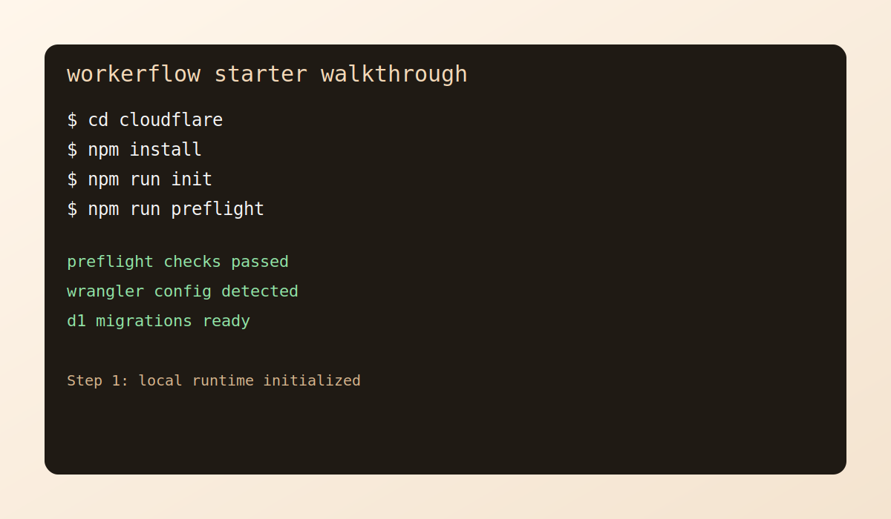
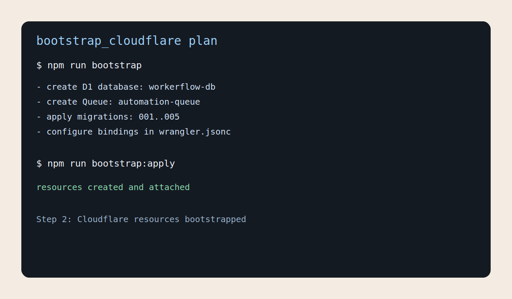
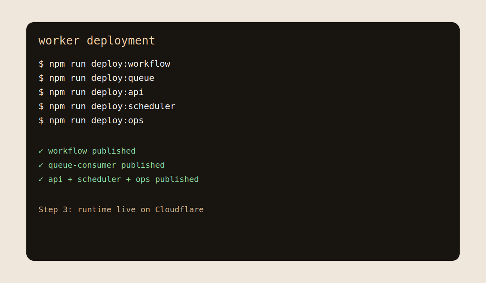
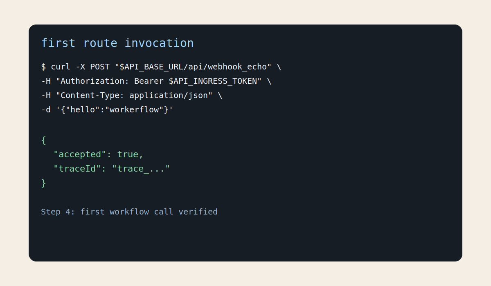

# Starter Walkthrough

This walkthrough gets a new clone from zero to first successful route call.

## 1) Install and Initialize

```bash
cd cloudflare
npm install
npm run init
npm run preflight
```



## 2) Bootstrap Cloudflare Resources

```bash
cd cloudflare
npm run bootstrap
```

Then apply generated plan:

```bash
cd cloudflare
npm run bootstrap:apply
```



## 3) Deploy Runtime Workers

```bash
cd cloudflare
npm run deploy:workflow
npm run deploy:queue
npm run deploy:api
npm run deploy:scheduler
npm run deploy:ops
```



## 4) Call Your First Workflow Route

Invoke `webhook_echo` from any terminal:

```bash
curl -X POST "$API_BASE_URL/api/webhook_echo" \
  -H "Content-Type: application/json" \
  -H "Authorization: Bearer $API_INGRESS_TOKEN" \
  -d '{"hello":"workerflow"}'
```

Expected shape:

```json
{
  "accepted": true,
  "traceId": "..."
}
```



## Verify Runtime Health

```bash
curl "$WORKFLOW_BASE_URL/health"
curl "$WORKFLOW_BASE_URL/health/config"
```

Both endpoints should return `ok: true`.
